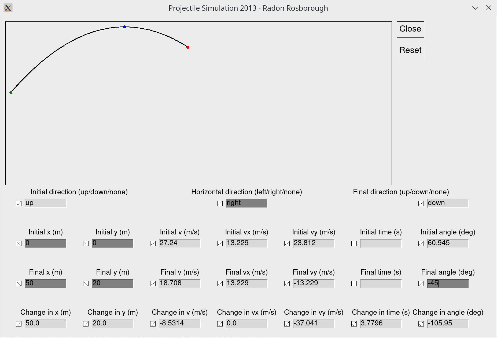

# Projectile Simulator

Class project for my AP Physics class in tenth grade. We were supposed
to do an actual experiment, but I hated labs (still do, in fact), so I
convinced my teacher to let me do a computer simulation instead. It
was probably more work, but I was a lot happier.

